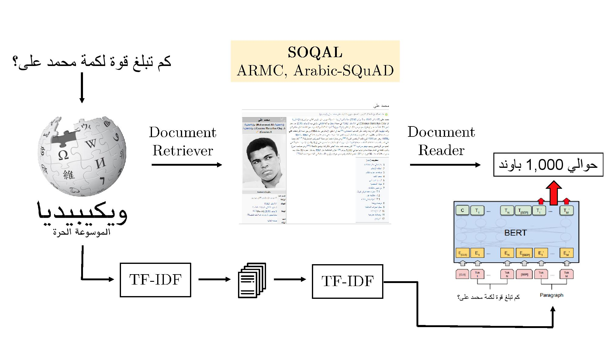

# SOQAL: Neural Arabic Question Answering
This repository includes the code and dataset described in our [WANLP 2019 paper Neural Arabic Question Answering](https://arxiv.org/abs/1906.05394) by Hussein Mozannar, Karl El Hajal, Elie Maamary and Hazem Hajj.


*  See below how to run a demo of our open domain question answering system in Arabic

*  Google Colab for training BERT on Arabic-SQuAD and ARCD: [Colab](https://colab.research.google.com/drive/19a_jIKpjhQez0KTa_Qwh2BW2nryGXzhb)

Quick Links:
*  [Datasets](data/README.md)
*  [BERT](bert/README.md)
*  [Document Retrievers](retriever/README.md)
*  [Getting Arabic Wikipedia](arwiki/README.md)
*  [Tools for Creating our datasets](dataset_creation/README.md)
*  [Document Reading baselines](baselines_reading/README.md)
## Arabic Open Domain Question Answering

This work builds a system for open domain
factual Arabic question answering (QA) using
Wikipedia as our knowledge source. This
constrains the answer of any question to be a
span of text in Wikipedia. However, this enables to use neural reading comprehension models for our end goal.
 
Open domain QA
for Arabic entails three challenges: annotated
QA datasets in Arabic, large scale efficient information
retrieval and machine reading comprehension.
To deal with the lack of Arabic
QA datasets we present the Arabic Reading
Comprehension Dataset (ARCD) composed of
1,395 questions posed by crowdworkers on
Wikipedia articles, and a machine translation
of the Stanford Question Answering Dataset
(Arabic-SQuAD) containing 48,344 questions.

Our system for open domain
question answering in Arabic (SOQAL)
is based on three components: (1) a document
retriever using a hierarchical TF-IDF approach, (2) a neural reading comprehension
model using the pre-trained bi-directional
transformer BERT and finally (3) a linear answer ranking module to obtain .

Credit: This work draws inspiration from [DrQA](https://github.com/facebookresearch/DrQA). 

## Platform
Tested for Python 3.6 on Windows 8,10 and Linux. Most commands are written assuming Windows.

## Installing SOQAL
(for Windows) Create a new virtual environment (you need to install virtualenv if you want) and activate it:
```shell
virtualenv venv
venv\Scripts\activate
```
Now you are in the virtual environment you have created and will install things here.


Run the following commands to clone the repository and install SOQAL:
```shell
git clone https://github.com/husseinmozannar/SOQAL.git
cd SOQAL
pip install -r requirements.txt
```


## Demo
After installing the required packages, we have to download trained retriever and reader.

First BERT model: [cased multilingual](https://storage.googleapis.com/bert_models/2018_11_23/multi_cased_L-12_H-768_A-12.zip), trained reader [trained BERT](https://storage.googleapis.com/soqal_traind_models/mod.zip) and checkpoint file [checkpoint](https://storage.googleapis.com/soqal_traind_models/checkpoint): export the mod.zip and place the checkpoint file inside the mod folder, retriever [retriever](https://storage.googleapis.com/soqal_traind_models/tfidfretriever.p).

Export BERT model and place in bert/, export trained reader and place it in bert/ and place tfretriever.p in retriever/

To interactively ask Arabic open-domain questions to SOQAL, follow the instructions bellow: 

```shell
python demo_open.py ^
-c bert/multi_cased_L-12_H-768_A-12/bert_config.json ^
-v bert/multi_cased_L-12_H-768_A-12/vocab.txt ^
-o bert/mod/ ^
-r retriever/tfidfretriever.p
```

And on your browser go to:
```
localhost:9999
```
## Citation

Please cite our paper if you use our datasets or code:

```
@inproceedings{mozannar-etal-2019-neural,
    title = "Neural {A}rabic Question Answering",
    author = "Mozannar, Hussein  and
      Maamary, Elie  and
      El Hajal, Karl  and
      Hajj, Hazem",
    booktitle = "Proceedings of the Fourth Arabic Natural Language Processing Workshop",
    month = aug,
    year = "2019",
    address = "Florence, Italy",
    publisher = "Association for Computational Linguistics",
    url = "https://www.aclweb.org/anthology/W19-4612",
    doi = "10.18653/v1/W19-4612",
    pages = "108--118",
    abstract = "This paper tackles the problem of open domain factual Arabic question answering (QA) using Wikipedia as our knowledge source. This constrains the answer of any question to be a span of text in Wikipedia. Open domain QA for Arabic entails three challenges: annotated QA datasets in Arabic, large scale efficient information retrieval and machine reading comprehension. To deal with the lack of Arabic QA datasets we present the Arabic Reading Comprehension Dataset (ARCD) composed of 1,395 questions posed by crowdworkers on Wikipedia articles, and a machine translation of the Stanford Question Answering Dataset (Arabic-SQuAD). Our system for open domain question answering in Arabic (SOQAL) is based on two components: (1) a document retriever using a hierarchical TF-IDF approach and (2) a neural reading comprehension model using the pre-trained bi-directional transformer BERT. Our experiments on ARCD indicate the effectiveness of our approach with our BERT-based reader achieving a 61.3 F1 score, and our open domain system SOQAL achieving a 27.6 F1 score.",
}
```
